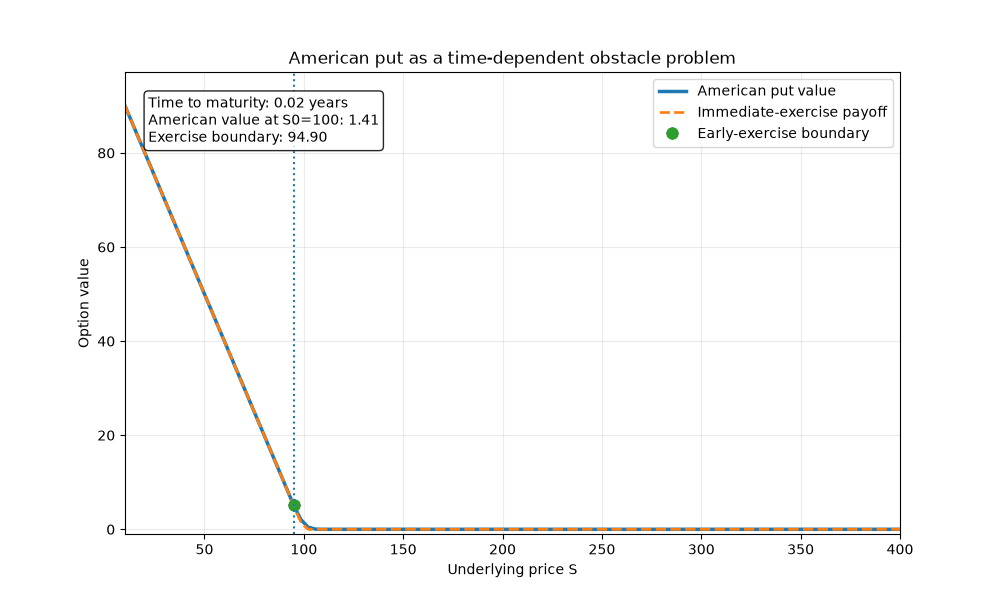

# American Optimal Stopping Extension

This folder contains a self-directed financial extension of the main obstacle-problem project.

The central idea is that American option pricing is an optimal stopping problem and therefore has a natural obstacle formulation.

The numerical methods developed for the obstacle problem can consequently be reused for American option pricing.

## American put as an obstacle problem

For an American put with strike $K$, the immediate-exercise payoff is

$$g(S)=\max(K-S,0).$$

The American option holder may exercise before maturity, so the option value must satisfy

$$V(t,S)\geq g(S).$$

In the continuation region, where $V(t,S)>g(S)$, the Black-Scholes pricing PDE holds.

In the exercise region,

$$V(t,S)=g(S).$$

The interface between the two regions is the free boundary. For an American put, this boundary represents the stock-price level below which immediate exercise becomes optimal.

This is the financial analogue of the contact boundary in the original obstacle problem.

## Numerical method

The pricing implementation uses the following steps:

1. transform from calendar time to time to maturity,
2. transform the stock-price coordinate using log-price,
3. apply an exponential transformation to remove the first-order and reaction terms,
4. discretize the transformed spatial problem using P1 finite elements,
5. discretize time using implicit Euler,
6. solve a bound-constrained convex quadratic optimization problem at every time step.

The current implementation uses SciPy L-BFGS-B as a generic bound-constrained optimizer.

A planned numerical extension is to replace this with a primal-dual active-set method that exploits the complementarity structure of the obstacle problem directly.

## Benchmark

The default benchmark parameters are:

- spot price $S_0=100$,
- strike $K=100$,
- risk-free rate $r=0.05$,
- volatility $\sigma=0.20$,
- maturity $T=1$ year.

For this benchmark, the FEM implementation gives an American put value of approximately $6.09$.

The corresponding European Black-Scholes put value is approximately $5.57$.

The positive difference represents the value of the American early-exercise feature.

## Numerical results

| American put value and payoff | Early-exercise boundary |
| --- | --- |
|  |  |

The American put value remains above the immediate-exercise payoff.

The recovered early-exercise boundary separates the exercise region from the continuation region.

## Visual intuition: obstacle structure and time to maturity

The animation below shows numerical American put solutions for different times to maturity.

Close to expiration, the option value approaches the payoff obstacle. As the remaining lifetime increases, continuation value becomes more important and the option value separates from the payoff.

The marked contact point tracks the approximate early-exercise boundary.



## Validation against a CRR benchmark

The FEM implementation is validated against an independent Cox-Ross-Rubinstein American put pricer.

A 5000-step CRR tree is used as a high-resolution numerical reference.

For the benchmark parameters, the reference value is approximately

$$V_{\mathrm{CRR}}\approx6.0902.$$

A joint mesh and time refinement experiment gives:

| Elements | Time steps | FEM price | Absolute difference to CRR |
| ---: | ---: | ---: | ---: |
| 50 | 50 | 6.18746 | 0.09724 |
| 100 | 100 | 6.12958 | 0.03936 |
| 200 | 200 | 6.09059 | 0.00037 |
| 400 | 400 | 6.08896 | 0.00125 |

The difference from the CRR reference becomes small at finer resolutions, although it is not monotone under joint refinement.

The 200-by-200 benchmark therefore provides close agreement with an independent numerical method without claiming an exact or monotone convergence rate.

| Joint refinement | Difference to CRR |
| --- | --- |
|  |  |

## Deterministic analytics layer

`analytics.py` provides a structured interface around the numerical pricing engine.

The current analytics tools include:

- `price_option`: price one American put scenario,
- `compare_scenarios`: compare a base scenario with a parameter shock,
- `sweep_parameter`: reprice over several values of one parameter,
- `analyze_exercise_boundary`: inspect the estimated early-exercise boundary,
- `get_model_information`: return model, validation, and limitation information.

The analytics layer also validates numerical inputs before they reach the solver.

For example, a negative volatility input is rejected rather than passed to the pricing engine.

## Local tool-using LLM interface

The project includes an experimental local LLM interface implemented with Ollama and `qwen3:8b`.

The goal is to provide natural-language access to the deterministic pricing engine while keeping the numerical computation separate from language generation.

```text
User question
    |
    v
Local LLM
Ollama + qwen3:8b
    |
    v
Tool selection
ai_assistant.py
    |
    v
Deterministic analytics
analytics.py
    |
    v
Finite element pricing engine
american_option.py
    |
    v
Numerical result
    |
    v
Natural-language explanation
```

The model can answer questions such as:

- "What numerical model do you use and how has it been validated?"
- "Price an American put with spot 100, strike 100, volatility 20%, rate 5%, and one year to maturity."
- "What happens if volatility rises from 20% to 30% while everything else stays the same?"

For quantitative pricing questions, the LLM is instructed to use the deterministic tools rather than generate numerical prices itself.

This separation provides a simple example of grounded AI-assisted analytics:

- the LLM interprets the user's request,
- Python functions perform the numerical computation,
- the returned numerical values remain the source of truth,
- invalid inputs can be rejected deterministically,
- the LLM is used primarily for interaction and explanation.

## Example scenario analysis

For the benchmark American put, increasing volatility from $20\%$ to $30\%$ while keeping the remaining parameters fixed produces approximately:

- American price at $20\%$ volatility: $6.09$,
- American price at $30\%$ volatility: $9.86$,
- price increase: $3.77$,
- exercise boundary at $20\%$ volatility: approximately $80.38$,
- exercise boundary at $30\%$ volatility: approximately $69.36$.

The lower exercise boundary means that under the higher-volatility scenario, the underlying must fall further before immediate exercise becomes optimal.

## Current scope and limitations

The current numerical engine is intentionally limited to:

- American put options,
- one underlying asset,
- Black-Scholes dynamics,
- constant volatility,
- constant risk-free rate,
- P1 finite elements,
- implicit Euler time stepping,
- a generic L-BFGS-B optimizer.

The current LLM interface is a local analytical prototype rather than a production trading or advisory system.

## Files

- `american_option.py`: finite element American put pricing engine.
- `validation.py`: independent CRR benchmark.
- `analytics.py`: deterministic pricing and scenario-analysis tools.
- `ai_assistant.py`: local tool-using LLM interface.
- `experiments/run_american_put.py`: American put example and plotting.
- `experiments/convergence_validation.py`: comparison with the CRR benchmark under refinement.
- `experiments/run_ai_assistant.py`: interactive command-line LLM interface.
- `experiments/make_exercise_animation.py`: explanatory obstacle/free-boundary animation.

## Running the American put example

From the repository root:

```bash
python american_options/experiments/run_american_put.py
```

## Running the validation experiment

```bash
python american_options/experiments/convergence_validation.py
```

## Generating the animation

```bash
python american_options/experiments/make_exercise_animation.py
```

## Running the local LLM assistant

Create and activate the Python environment if necessary:

```bash
python -m venv .venv
source .venv/bin/activate
pip install -r requirements.txt
```

Install Ollama separately and pull the local model:

```bash
ollama pull qwen3:8b
```

Start Ollama:

```bash
ollama serve
```

Then, in another terminal:

```bash
source .venv/bin/activate
python american_options/experiments/run_ai_assistant.py
```

Type `quit` or `exit` to stop the assistant.

## Planned extensions

The main numerical extensions currently planned are:

- primal-dual active-set solution of the obstacle problem,
- comparison between the structure-exploiting solver and generic L-BFGS-B,
- P2 finite elements,
- further study of free-boundary approximation,
- possible higher-dimensional obstacle problems.

The same numerical developments can later be transferred to the American-option extension.