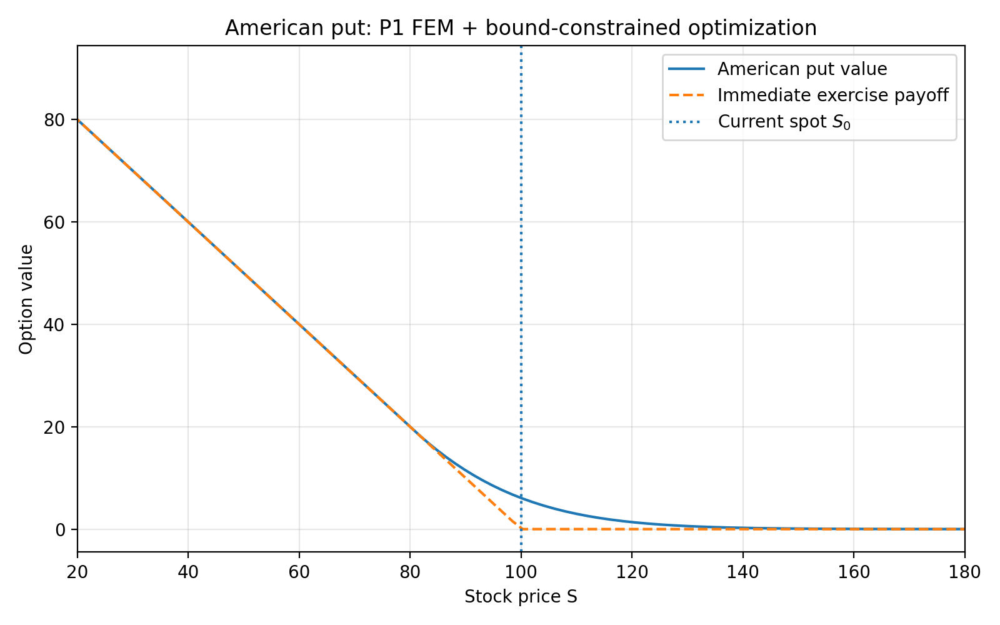
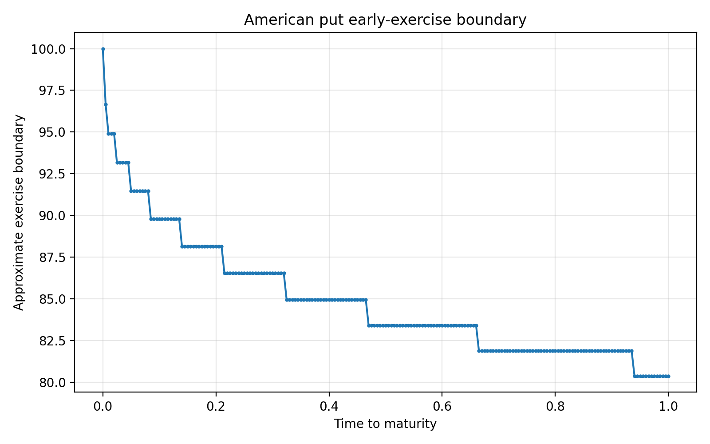
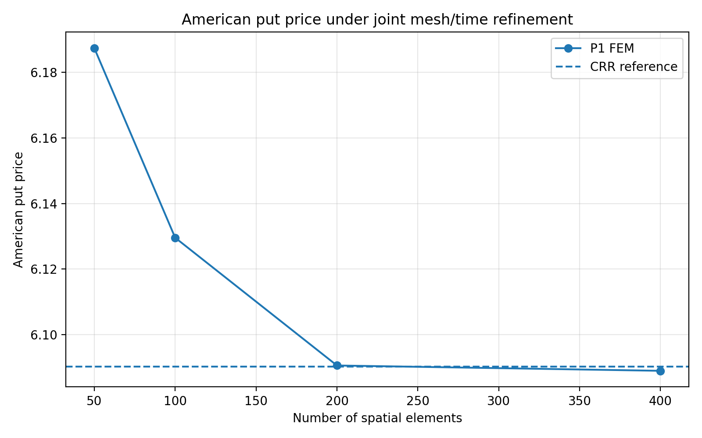
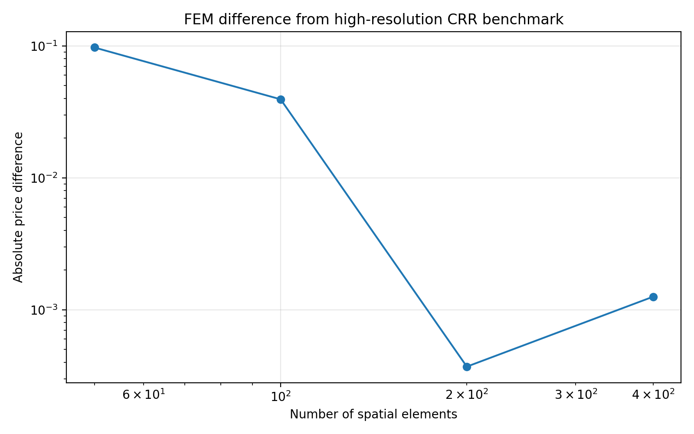

# American Option Pricing Extension

This extension applies the obstacle-problem framework to optimal stopping in mathematical finance.

## American put as an obstacle problem

For an American put with strike $K$, the immediate exercise payoff is $g(S)=\max(K-S,0)$.

Because the holder may exercise at any time before maturity, the option value must satisfy $V(t,S)\geq g(S)$.

Where $V(t,S)>g(S)$, immediate exercise is not optimal and the option is in the continuation region. There the Black-Scholes PDE holds:

$$V_t+\frac{1}{2}\sigma^2S^2V_{SS}+rSV_S-rV=0.$$

Where $V(t,S)=g(S)$, the option is in the exercise region.

The boundary separating the continuation and exercise regions is the free boundary of the obstacle problem. Financially, it represents the optimal early-exercise boundary.

## Log-price transformation

To connect the pricing problem with the finite element obstacle solver, introduce time to maturity $\tau=T-t$ and log-moneyness $x=\log(S/K)$.

Writing $v(\tau,x)=V(T-\tau,Ke^x)$ gives

$$v_\tau=\frac{1}{2}\sigma^2v_{xx}+\left(r-\frac{1}{2}\sigma^2\right)v_x-rv.$$

The exponential transformation $v=e^{\alpha x+\beta\tau}u$ is used to remove the first-derivative and reaction terms.

With suitable choices of $\alpha$ and $\beta$, the continuation equation becomes

$$u_\tau=\frac{1}{2}\sigma^2u_{xx}.$$

This transformed equation has the form of a heat equation and leads to a symmetric finite element discretization.

## Finite element and time discretization

The transformed equation is discretized in space using the same piecewise-linear P1 finite elements as the stationary obstacle problem.

The stiffness matrix is defined by $A_{ij}=\int \lambda_i'(x)\lambda_j'(x)\,dx$.

Because the problem is time dependent, a mass matrix is also required. It is defined by $M_{ij}=\int \lambda_i(x)\lambda_j(x)\,dx$.

Using implicit Euler with time step $\Delta\tau$ gives the system matrix

$$B=\frac{M}{\Delta\tau}+\frac{1}{2}\sigma^2A.$$

At each time step, the American exercise constraint produces a convex quadratic obstacle problem:

$$\min_{U\geq\Psi}\left(\frac{1}{2}U^TBU-b^TU\right).$$

Here, $\Psi$ represents the transformed American put payoff at the finite element degrees of freedom.

The current implementation solves this bound-constrained problem using SciPy's L-BFGS-B optimizer.

The same complementarity structure as in the stationary obstacle problem therefore appears at every time step: degrees of freedom in the exercise region lie on the obstacle, while those in the continuation region satisfy the discrete pricing equation.

## Numerical example

The current numerical example uses:

- spot price $S_0=100$,
- strike $K=100$,
- risk-free rate $r=0.05$,
- volatility $\sigma=0.20$,
- maturity $T=1$ year,
- 200 P1 finite elements,
- 200 implicit-Euler time steps.

The numerical American put value is approximately 6.09.

For comparison, the corresponding European Black-Scholes put value is approximately 5.57.

The American value is higher because the holder has the additional right to exercise before maturity.

The implementation also estimates the free boundary separating the continuation and early-exercise regions.

## Numerical results

The first figure compares the American put value with the immediate exercise payoff.



The second figure shows the numerically estimated optimal early-exercise boundary.



## Numerical validation

The American put implementation is validated against an independent Cox-Ross-Rubinstein binomial-tree benchmark.

The FEM calculation and the binomial tree solve the same optimal-stopping problem using different numerical formulations. The FEM implementation uses the Black-Scholes obstacle problem, while the CRR method uses backward induction and compares continuation with immediate exercise at every node.

A CRR tree with 5000 time steps gives a reference value of approximately 6.09022 for the benchmark parameters.

The FEM calculation is repeated under joint spatial and temporal refinement. The computed price approaches the CRR benchmark closely, with the 200-element calculation producing approximately 6.09059 and the 400-element calculation approximately 6.08896.

Because the spatial mesh and time step are refined simultaneously, this experiment is intended as a numerical validation and stabilization study rather than as an estimate of a formal convergence order. The different discretization errors need not decrease monotonically when refined together.



The difference from the CRR reference becomes small at the finer resolutions, although it is not monotone under joint refinement.



The validation experiment can be reproduced with:

```bash
python american_options/experiments/convergence_validation.py

## Outlook

The current financial extension intentionally uses the same generic L-BFGS-B optimizer as the first obstacle-problem implementation.

Planned numerical extensions include:

- replacing L-BFGS-B with a primal-dual active-set method,
- extending the spatial discretization from P1 to P2 finite elements,
- comparing convergence and computational efficiency,
- studying multidimensional obstacle problems arising from multi-asset or stochastic-volatility option models.